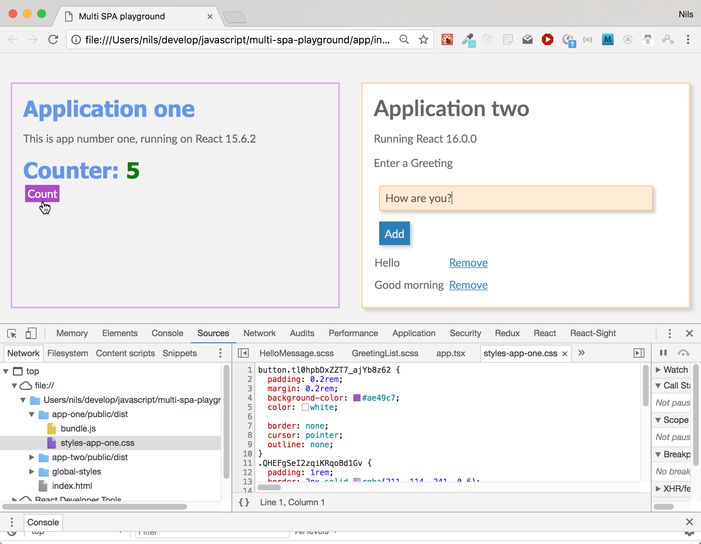

# Playground: use two react apps one page, isolate css with css modules

## Usage

1. Please run `npm install` in the root folder. This will install all dependencies in the two sample apps `app-one` and `app-two`

2. Build both apps by running `npm run dist` in the root folder. (Note: you can build the apps independently by running `npm run dist` directly in each of the app folders)

3. After building open the `app/index.html` file in the root folder using your browser.

## The apps

* There are two independent React apps (one using React 15.4, the other using React 16 with TypeScript) embedded on one page.

* Both apps have independent styling (only `normalize.css` and some global default styling is shared by both of them. See folder `global-styles`). See for example how the buttons and titles differ in both applications

* app-two uses SASS as CSS preprocessor

* Both app have sourcemaps for CSS enabled. When you inspect the styles in Chrome/Firefox, you directly jump to the original css/sass code instead of the compiled version.

* Both apps extract their css to an own file (app/app-XXX/public/dist/styles-app-XXX.css) using webpack's extract-text-plugin, so you can see what actual css (including the hashed class names) is generated by inspecting them on your filesystem.

* The root app (index.html and css in global-styles) is responsible for the overall layout of the page (i.e. where to put the individual apps)
